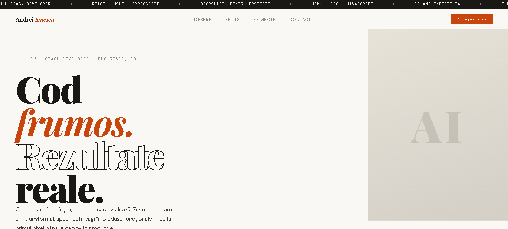

# Andrei Ionescu — Web Developer Portfolio

An elegant and modern personal portfolio website for Andrei Ionescu, web developer and technical consultant.

**Live Demo**: https://iam269.github.io/websiteanimation2/



---

## 🌐 Overview

This project is a complete showcase portfolio website, developed with pure HTML, CSS, and JavaScript without external frameworks. The design is refined, featuring elegant typography and subtle animations that provide a professional and memorable experience for visitors.

## ✨ Features

### Design & UX
- **Premium typography**: Combination of Playfair Display (serif), DM Mono (monospace), and DM Sans (sans-serif)
- **Color palette**: Cream, paper, ink tones with orange/red accents
- **Sticky navigation**: Fixed navigation bar with backdrop blur effect (glassmorphism)
- **Responsive design**: Adapted for all devices

### Animations
- **Marquee/Ticker**: Animated banners at the top of the page
- **Slide-up animations**: Elements animate on page load
- **Scroll reveal**: Scroll-triggered animations using IntersectionObserver
- **Hover effects**: Interactive effects on buttons, links, and media elements

### Page Structure
1. **Hero Section**: Introduction with name, title, and call-to-action
2. **About Me**: Personal presentation and experience
3. **Services/Projects**: Showcase of completed projects
4. **Contact**: Contact form and contact information

## 🛠️ Technologies Used

- **HTML5** — Semantic page structure
- **CSS3** — Advanced styling, CSS variables, animations
- **JavaScript (ES6+)** — Interactivity and scroll animations
- **Google Fonts** — External typography

## 🚀 How to Run the Project

1. Clone or download this repository
2. Open `index.html` in any modern browser
3. Or use a local server (recommended for optimal performance):

```bash
# With Python
python -m http.server 8000

# Or with Node.js (if you have http-server installed)
npx http-server
```

Then access `http://localhost:8000` in your browser.

## 📁 File Structure

```
.
├── index.html    # Main page (contains inline CSS/JS)
├── network.png   # Favicon icon
└── README.md     # This file
```

## 🎨 Customization

### Colors
Colors can be modified in the `:root` section of the CSS:

```css
:root {
  --cream:  #f5f2ec;
  --paper:  #faf8f4;
  --ink:    #1a1814;
  --accent: #c8460d;
}
```

### Fonts
Fonts are loaded from Google Fonts and can be changed in the `<link>` section in `<head>`.

## 📝 Content

The text is in Romanian and can be edited directly in the `index.html` file to reflect the desired personal information.

---

Created with ❤️ by Ionita Aurel Mihai
